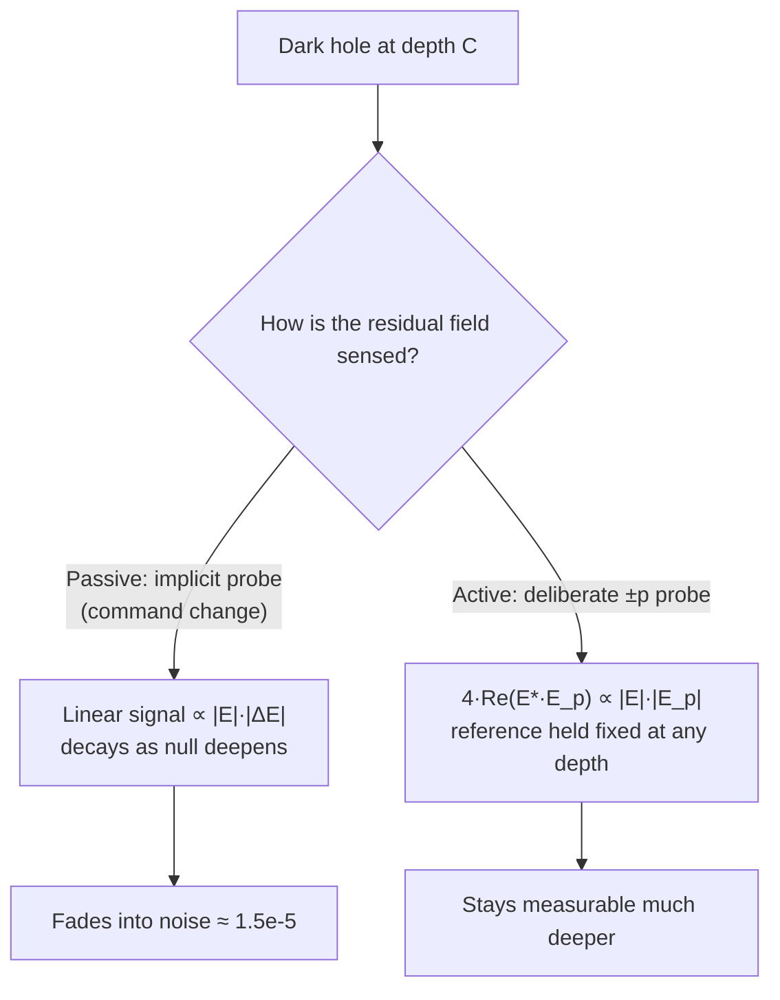
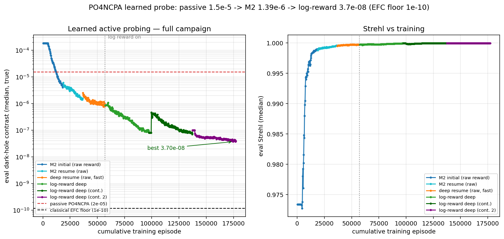

# Learned active probing — digging a deeper dark hole with model-based RL

*Written 2026-08-26. Companion to [`PLAN_active_probing.md`](PLAN_active_probing.md) and
[`PROJECT_STATUS.md`](PROJECT_STATUS.md). Reference paper: Nousiainen, Taskin, Kasper,
Orban de Xivry & Absil, "Focal-plane wavefront control with model-based reinforcement
learning," A&A 709, A267 (2026) — [arXiv:2604.00993](https://arxiv.org/abs/2604.00993),
algorithm **PO4NCPA**.*

---

## TL;DR

We reproduced **PO4NCPA** (model-based RL that learns a differentiable model of the
focal-plane camera and trains its controller by back-propagating the reward through that
model), then extended it along a direction the paper explicitly lists as future work:
**digging a genuinely deep dark hole**.

- Passive PO4NCPA — using only the paper's sequential-phase-diversity signal — plateaus at
  **~1.5e-5** dark-hole contrast, about 5 decades above the **1.18e-10** ideal correction
  floor. This is an *information* limit, not a control limit: the same 55 modes can reach the
  floor; the passive dark image just does not carry enough signal to find the command.
- Adding **learned active probing** — the policy injects a deliberate probe and reads the
  probe-difference image — digs from that plateau down to **3.70e-8**, a **~400×**
  improvement, with Strehl rising to ~1.0 (no PSF-wrecking).
- Preliminary robustness checks show the learned controller **self-calibrates** (reaches
  7.5e-8 even when trained on a 20%-miscalibrated system) and **tracks a drifting
  disturbance** (~5e-5 at a 10-frame correlation time, still improving).

The contribution is **model-based RL that learns its own focal-plane probing to break the
passive sensing plateau** — a deeper-dark-hole extension of the paper, using the paper's own
setup and reference metrics.

> **Scope note.** A formal head-to-head against classical Electric Field Conjugation (EFC) is
> deliberately **out of scope here**, mirroring the reference paper (which discusses EFC but
> does not benchmark against it). All comparisons below are against the paper's own reference
> points — the ideal correction floor and passive PO4NCPA. An EFC comparison is a natural
> later axis, not a focus of this experiment yet.

---

## 1. What PO4NCPA does, and what it optimises

PO4NCPA is a **model-based** reinforcement-learning controller for non-common-path
aberrations (NCPAs). It has two neural networks trained together, one episode at a time:

1. **A dynamics model** (an ensemble of 5 small CNNs) that predicts the *next* focal-plane
   image from the current image, the previous image, and the commands. This is a learned,
   differentiable "camera simulator."
2. **A policy** that maps the recent images + last command to the next DM command. It is
   trained by **back-propagating the reward through 2–7-step imagined rollouts** of the
   dynamics model — so the policy gets an analytic gradient of predicted focal-plane light,
   even where blind exploration gives it nothing.

The reward is `−‖oₜ₊₁‖²`, the total residual light in the (cube-root preprocessed) focal
image. **This framing matters:** PO4NCPA optimises *total* focal-plane residual flux — a
Strehl-like quantity — and the paper reports it reaches **near-optimal on that metric**:

| Paper configuration | PO4NCPA | Idealised reference (fitting error) |
|---|---|---|
| Standard imaging, static | Strehl **99.4%** | 99.6% |
| Standard imaging, dynamic | Strehl 99.4% | 99.6% (+ 1-step delay) |
| Perfect coronagraph, static | residual flux **0.102%** | 0.104% |
| ELT + vector-vortex + noise | up to **40×** at 1.5 λ/D | open loop |

It resolves the classical **phase-sign ambiguity** (a single intensity image cannot tell a
`+δ` aberration from `−δ`) using **sequential phase diversity**: the step-to-step command
change acts as an *implicit* probe, and the pair of successive images carries the sign. It
does this with **no deliberate probe and no hand-built optical model** — its selling point.
Crucially, the paper notes this signal weakens under a coronagraph and lists **"a reward
function to dig a deeper dark hole"** as explicit future work.

**We take up that future-work thread.**

---

## 2. The extension: deep dark-hole contrast

The paper's reward is dominated by the bright parts of the image, so "near-optimal residual
flux" does **not** mean "10⁻¹⁰ dark-hole contrast." We kept the paper's setup (**55 Zernike
modes**, cube-root residual, sequential phase diversity, per-mode action scaling, coronagraph
on) and added a **small dark hole (1.5–4 λ/D)** inside the 33×33 field, with dark-hole
*contrast* as the figure of merit.

### The reference points (our sim, identical geometry/modes)

| Reference | Median dark-hole contrast | Meaning |
|---|---|---|
| Ideal 55-mode correction floor | **1.18e-10** | best any controller could do on this geometry |
| Passive PO4NCPA (our replication) | ~1.5e-5 | the paper's approach — sequential diversity only |
| Episode start (0.026 waves RMS) | 1.78e-4 | Strehl 0.974 |

The ~5-decade passive-vs-floor gap is **not a shortcoming of PO4NCPA** — it never tried to
dig this deep. It measures **how much information is left on the table by passive sensing**.
That the information is *recoverable* is not hypothetical: a diagnostic (M0 in
[`PLAN_active_probing.md`](PLAN_active_probing.md)) showed **8 modal probes reconstruct the
complex residual field to 0.68%** at the plateau — the signal exists, the passive image just
cannot see it.

### Why a deliberate probe helps (the mechanism)

Sequential phase diversity *does* recover the sign — the command change is an implicit probe,
and the difference of two frames contains a term **linear** in the residual field that carries
its sign. The subtlety: that linear term is **proportional to the residual field itself**, so
as the null deepens the sign-carrying signal shrinks toward the noise. A deliberate `±p` probe
fixes both problems at once:

```
I(+p) − I(−p) = 4·Re(E* · E_p)
```

The antisymmetric pair **cancels** the probe's self-intensity, and `E_p` is a *known,
tunable reference you can hold fixed independent of null depth* — so the signal stays
`∝ |E|` (linear) instead of `∝ |E|²` (quadratic) all the way down. That is why deliberate
probing keeps digging where the passive signal fades at ~1.5e-5.



**Our novelty vs. the paper:** the probe *and* the reconstruction are **learned end-to-end** —
the reward back-propagates `correction ← reconstruction ← probe` through the dynamics model,
so the probe is automatically shaped to be maximally informative. No hand-built model, no
predefined probe sequence.

---

## 3. Result — learned active probing digs ~400× past the plateau

We gave the policy a two-headed action `[probe, correction]`, added the probe-difference
image as a second observation channel, and let the dynamics model predict both channels
(`src/po4ncpa_probe.py`, `src/po4ncpa_infogain.py`). Over a staged training campaign
(~175k episodes; raw reward → log-contrast reward + learning-rate/exploration decay to keep a
roughly constant gradient per decade near the floor) the learned probe digs **from the passive
1.5e-5 plateau down to 3.70e-8**, Strehl rising to 0.99997 — a clean monotonic descent, no
wrecking.



*Left: median held-out dark-hole contrast vs. cumulative training episode. The upper dashed
line is passive PO4NCPA (1.5e-5); the lower dashed line is the **ideal 55-mode correction
floor** (~1.18e-10). The learned probe descends ~2.6 decades past the passive plateau to
3.70e-8 and was still slowly improving when stopped. Right: Strehl climbs to ~1.0 and stays —
the controller refines the wavefront, it does not wreck it.*

**Verdict:** learned probing beats passive sensing by ~400× and directly demonstrates the
paper's "deeper dark hole" future direction is achievable with model-based RL. It stopped
~310× above the ideal floor and was still descending; whether it reaches the floor is an open
question (see caveats).

---

## 4. Preliminary robustness of the learned controller

Two quick stress tests of the *learned* controller (not yet a focus — single operating points,
still-training runs). Both are referenced to the ideal floor (1.18e-10) and the passive
plateau (1.5e-5).

**Model miscalibration (self-calibration).** A per-mode corrector-gain error (the truth applies
`gain·coeff`; nominal control assumes unit gain) is the canonical actuator-gain uncertainty.
Trained *on* a 20%-RMS-miscalibrated system (`po4ncpa_probe_mismatch.slurm`), the learned probe
still reaches **7.5e-8, Strehl 1.0** — it learns the true system end-to-end rather than
assuming a nominal model. A grey-box variant that pins each episode to a fixed nominal base
command did **worse** (2.6e-7): freezing part of the loop to a wrong model imports that model's
error. **Takeaway: letting the policy learn the real system is what buys the robustness.**

**Dynamic disturbance (tracking).** Under an AR(1) "boiling" disturbance at fixed WFE
(correlation time τ = 10 control frames), a learned probe trained from scratch
(`po4ncpa_probe_dynamic_scratch.slurm`) tracks the drift down to **~5e-5**, monotonically the
whole run and still improving when stopped — same descent shape as the static campaign's first
40k episodes (which later dug 4 more decades). A full τ-sweep is the natural next step.

| Stress test | Learned probe | vs. passive plateau (1.5e-5) |
|---|---|---|
| Static, perfect model | 3.70e-8 | ~400× deeper |
| 20% gain miscalibration | 7.5e-8 | ~200× deeper |
| Dynamic, τ=10 frames | ~5e-5 (still descending) | comparable, early in training |

---

## 5. Relation to the paper

This work is **complementary to PO4NCPA, not corrective of it.** The paper established that
model-based RL reaches near-optimal *Strehl / total-flux* control with no optical model. We
extended the same algorithm and setup to *deep-contrast* control — the "deeper dark hole"
the authors named as future work — and showed that **learned active probing** breaks the
passive sensing plateau by ~400×, while keeping the paper's core virtues (no hand-built model,
no predefined probe, no PSF-wrecking).

---

## 6. Caveats

- **Idealised optics.** Single DM, ideal Zernike corrector, 55 modes, small dark hole. Real DM
  influence functions, larger holes, and amplitude aberrations are not modelled.
- **The learned probe has not reached the floor.** It stopped at 3.70e-8, still descending; we
  do not claim it reaches 1.18e-10.
- **Robustness results are single points on still-training runs** — directional, not final. A
  gain-mismatch sweep and a τ-sweep are the obvious next steps.
- **EFC comparison deliberately deferred** (see scope note). When it becomes a focus, the
  honest baseline is a well-calibrated EFC, which reaches the floor in the clean regime.

---

## 7. Reproduce

| Result | Train script | Eval / analysis |
|---|---|---|
| Passive PO4NCPA (corona) | `slurm/po4ncpa_corona.slurm` | `slurm/eval_po4ncpa.slurm` |
| Learned probe campaign | `slurm/po4ncpa_probe*.slurm`, `po4ncpa_probe_logdeep{,2,3}.slurm` | fig `notebooks/figs/probe_campaign.png` |
| Self-calibration (mismatch) | `slurm/po4ncpa_probe_mismatch.slurm [σ]` | `slurm/po4ncpa_probe_hybrid.slurm [σ]` |
| Dynamic tracking | `slurm/po4ncpa_probe_dynamic_scratch.slurm` | `logs/po4ncpa_dynamic_scratch_t10/` |
</content>
