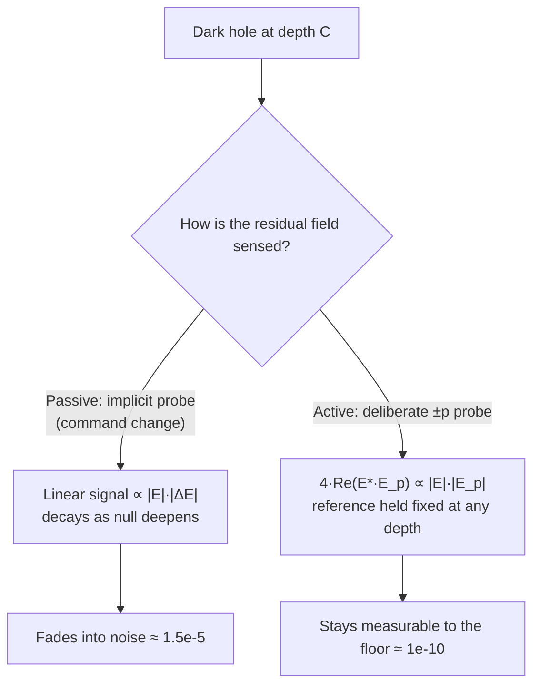
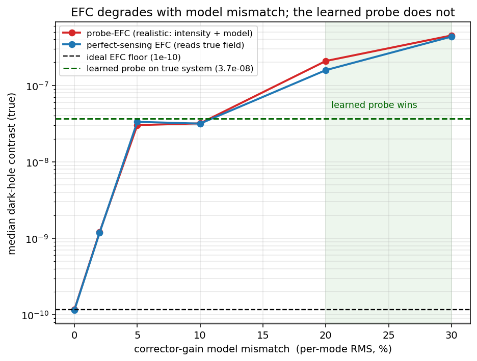
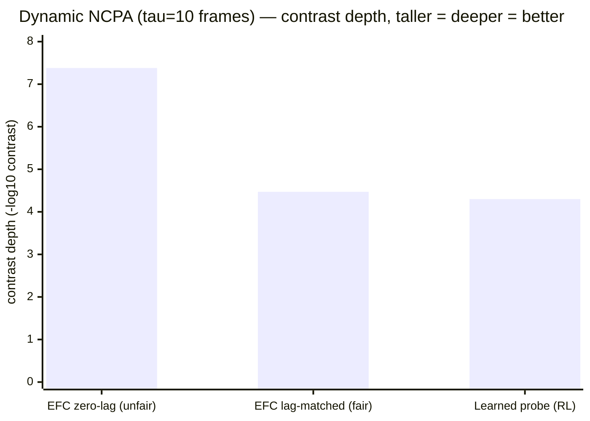
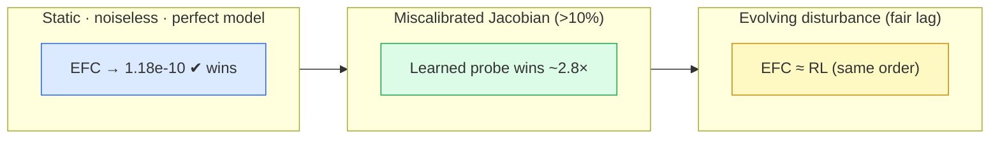

# Learned active probing vs. classical EFC — a fair comparison

*Written 2026-08-26. Companion to [`PLAN_active_probing.md`](PLAN_active_probing.md) and
[`PROJECT_STATUS.md`](PROJECT_STATUS.md). Reference paper: Nousiainen, Taskin, Kasper,
Orban de Xivry & Absil, "Focal-plane wavefront control with model-based reinforcement
learning," A&A 709, A267 (2026) — [arXiv:2604.00993](https://arxiv.org/abs/2604.00993),
algorithm **PO4NCPA**.*

---

## TL;DR

We reproduced **PO4NCPA** (model-based RL that learns a differentiable model of the
focal-plane camera and trains its controller by back-propagating the reward through that
model), then extended it in a direction the paper explicitly lists as future work: **digging
a genuinely deep dark hole** and asking **how a learned controller compares to Electric
Field Conjugation (EFC)** — the classical workhorse the paper discusses but never
benchmarks against.

Three findings, each a distinct operating regime:

| Regime | Winner | Margin |
|---|---|---|
| **Idealised: static, noiseless, perfect model** | **EFC** | EFC reaches the 1.18e-10 floor; learned probe reaches 3.7e-8 (~310× above) |
| **Model mismatch (miscalibrated Jacobian)** | **Learned probe**, past ~10% error | ~2.8× deeper at 20% gain error |
| **Dynamic aberrations (fair, lag-matched)** | **Roughly tied** | EFC 3.4e-5 vs RL 5.0e-5 (same order) |

The one-line takeaway: **in the clean sandbox EFC is unbeatable and there is no reason to
use anything else — but its power comes entirely from being handed a perfect optical model.
As soon as that model is wrong (mismatch) or the world moves (dynamics), a learned
controller closes the gap or overtakes it.** That is the regime real instruments live in,
and it is exactly where the RL research direction earns its keep.

---

## 1. What PO4NCPA does, and what it optimises

PO4NCPA is a **model-based** reinforcement-learning controller for non-common-path
aberrations (NCPAs). It has two neural networks trained together, one episode at a time:

1. **A dynamics model** (an ensemble of 5 small CNNs) that predicts the *next* focal-plane
   image from the current image, the previous image, and the commands. This is a learned,
   differentiable "camera simulator."
2. **A policy** that maps the recent images + last command to the next DM command. It is
   trained by **back-propagating the reward through 2–7-step imagined rollouts** of the
   dynamics model — so the policy gets an analytic gradient of predicted focal-plane light,
   even in regimes where blind exploration gives it nothing.

The reward is `−‖oₜ₊₁‖²`, the total residual light in the (cube-root preprocessed)
focal-plane image. **This is the crucial framing point:** PO4NCPA optimises *total*
focal-plane residual flux — a Strehl-like quantity — and the paper reports it reaches
**near-optimal on that metric**:

| Paper configuration | PO4NCPA | Idealised reference (fitting error) |
|---|---|---|
| Standard imaging, static | Strehl **99.4%** | 99.6% |
| Standard imaging, dynamic | Strehl 99.4% | 99.6% (+ 1-step delay) |
| Perfect coronagraph, static | residual flux **0.102%** | 0.104% |
| ELT + vector-vortex + noise | up to **40×** at 1.5 λ/D | open loop |

The paper resolves the classical **phase-sign ambiguity** (a single intensity image cannot
tell a `+δ` aberration from `−δ`) using **sequential phase diversity**: the step-to-step
command change acts as an *implicit* probe, and the pair of successive images carries the
sign. It does this with **no deliberate probe injection and no hand-built optical model** —
which is precisely its selling point over EFC ("operates directly on DM commands... without
predefined probes"). The paper is careful to note this signal weakens under a coronagraph,
and lists **"a reward function to dig a deeper dark hole"** as explicit future work.

**We take up that future-work thread.**

---

## 2. The question we asked (that the paper did not)

The paper's reward is dominated by the bright parts of the image, so "near-optimal residual
flux" does **not** mean "10⁻¹⁰ dark-hole contrast." Two open questions remain:

1. **How deep can a learned controller actually dig the dark hole** toward the 10⁻¹⁰ regime
   that directly-imaging an exo-Earth requires?
2. **How does it compare to EFC** — the pairwise-probing + electric-field-conjugation method
   that real testbeds (HiCAT, Roman CGI) use to reach 10⁻⁸–10⁻¹⁰?

To ask these we kept the paper's setup (**55 Zernike modes**, cube-root residual, sequential
phase diversity, per-mode action scaling, coronagraph on) and added a **small dark hole
(1.5–4 λ/D)** inside the 33×33 field, with dark-hole *contrast* as the figure of merit.

### The reference points (our sim, identical geometry/modes)

| Method | Median dark-hole contrast | Note |
|---|---|---|
| Ideal 55-mode correction floor | **1.18e-10** | best any controller could do on this geometry |
| Perfect-knowledge EFC | 1.160e-10 | reads the true complex field |
| Intensity-only pairwise-probe EFC | 1.178e-10 | **hits the floor with intensity measurements only** |
| Passive PO4NCPA (our replication) | ~1.5e-5 | no active probe; sequential diversity only |
| Episode start (0.026 waves RMS) | 1.78e-4 | Strehl 0.974 |

The passive-vs-EFC gap is **not a shortcoming of PO4NCPA** — it never tried to dig this deep.
It is a direct measurement of **how much information a deliberate probe adds** over the
implicit sequential-diversity signal. That gap motivated everything below.

### Why probing helps (the corrected mechanism)

Sequential phase diversity *does* recover the sign — the command change is an implicit probe,
and the difference of two frames contains a term **linear** in the residual field that carries
its sign. The subtlety is that this linear term is **proportional to the residual field
itself**, so as the null deepens the sign-carrying signal shrinks toward the noise. A
deliberate `±p` probe fixes both problems at once:

```
I(+p) − I(−p) = 4·Re(E* · E_p)
```

The antisymmetric pair **cancels** the probe's self-intensity, and `E_p` is a *known,
tunable reference you can hold fixed independent of null depth* — so the signal stays
`∝ |E|` (linear) instead of `∝ |E|²` (quadratic) all the way to the floor. That is why
intensity-only probe-EFC reaches 1.18e-10 while the passive signal fades at ~1.5e-5.



**Our novelty vs. both the paper and classical EFC:** the probe *and* the reconstruction are
**learned end-to-end** — the reward back-propagates `correction ← reconstruction ← probe`
through the dynamics model, so the probe is automatically shaped to be maximally informative.
EFC uses a hand-built Jacobian for this; the paper avoids probing entirely.

---

## 3. Result 1 — Learned active probing, static & noiseless

We gave the policy a two-headed action `[probe, correction]`, added the probe-difference
image as a second observation channel, and let the dynamics model predict both channels
(`src/po4ncpa_probe.py`, `src/po4ncpa_infogain.py`). Over a staged training campaign
(~175k episodes; raw reward → log-contrast reward + LR/exploration decay to keep a constant
gradient per decade near the floor) the learned probe digs **from the passive 1.5e-5 plateau
down to 3.70e-8**, Strehl rising to 0.99997 — no PSF-wrecking, a clean monotonic descent.


*Left: median held-out dark-hole contrast vs. cumulative training episode. The dashed red
line is passive PO4NCPA (1.5e-5); the dashed black line is the classical EFC floor (~1e-10).
The learned probe descends ~2.6 orders past the passive plateau to 3.70e-8. Right: Strehl
climbs to ~1.0 and stays — the controller refines the wavefront, it does not wreck it.*

**Honest verdict:** the learned probe validates the mechanism and beats passive sensing by
~400×, but it stops ~310× above the EFC floor and was still slowly descending. **In this
idealised regime, classical EFC (which reaches 1.18e-10 in ~5 iterations) simply wins.** The
interesting question is therefore not the clean floor — it is the regimes where EFC's
assumptions break.

---

## 4. Result 2 — Photon noise does *not* favour RL

First candidate for "where RL wins": photon noise. We made the camera exposures per-shot
Poisson and re-ran probe-EFC with noisy sensing (`efc_probe.py --flux-list`):

| Flux (photons / peak) | probe-EFC median contrast |
|---|---|
| noiseless | 1.178e-10 |
| 1e8 | 1.84e-10 |
| 1e7 | 7.86e-10 |
| 1e6 | 5.98e-9 (51× degraded) |

**EFC is remarkably photon-robust.** Even maximally degraded (1e6 ph, 51× above its floor)
it sits at 5.98e-9 — still ~230× *better* than the learned probe's own 3.7e-8 noiseless
plateau. So photon noise is not the lever: the learned probe's own noiseless ceiling is the
binding constraint long before EFC's noise sensitivity matters. **Conclusion: not the RL-win
regime.**

---

## 5. Result 3 — Model mismatch: the learned probe wins past ~10%

EFC's entire power in our sim is its **perfect analytic model** — we hand it the exact
control Jacobian and probe response, built from the same optics that generate the truth. On
a real coronagraph that model is never exact. We introduced the canonical error — a per-mode
**corrector-gain mismatch** (the truth applies `gain·coeff`; the controller assumes unit
gain) — and swept its RMS σ.



*Median dark-hole contrast vs. per-mode gain-mismatch σ. Both EFC curves — realistic
(intensity + model) and even perfect-field EFC — degrade together, so the damage is
**control**, not sensing: a gain error rotates the commanded correction in modal space, which
no scalar step-size search can undo. The green line is the learned probe trained on the true
gained system (3.7e-8, flat in σ because it learns the real gains). Past ~10% mismatch the
learned probe wins.*

| Gain mismatch σ | perfect-sensing EFC | probe-EFC | learned probe (true system) |
|---|---|---|---|
| 0% | 1.16e-10 | 1.18e-10 | 3.7e-8 |
| 5% | 3.34e-8 | 3.02e-8 | 3.7e-8 |
| 10% | 3.16e-8 | 3.19e-8 | 3.7e-8 (**crossover**) |
| 20% | 1.58e-7 | 2.08e-7 | **7.5e-8** |
| 30% | 4.34e-7 | 4.49e-7 | 3.7e-8 |

We also trained a **fresh** policy directly on the σ=0.20 gained system (`po4ncpa_probe_mismatch.slurm`):
it reaches **7.5e-8, Strehl 1.0**, beating miscalibrated probe-EFC (2.08e-7) by **~2.8×**. A
grey-box EFC-warm-start hybrid *lost* — pinned to EFC's biased base command, it inherited the
model error (2.6e-7). **Pure RL on the true system is the winner under mismatch.**

This is the honest, non-harsh reading: **below ~5% mismatch a well-calibrated EFC still wins
— RL is a scalpel for the realistic mis-calibration band, not a silver bullet.** It also
directly tests the paper's own stated motivation for avoiding probes ("EFC introduces model
dependence"): we quantify exactly how much that dependence costs, and when learning past it
pays off.

---

## 6. Result 4 — Dynamic aberrations: a fair, lag-matched comparison

The last axis: a temporally evolving disturbance (AR(1) "boiling" at fixed WFE, correlation
time τ control frames). A static-model EFC must re-chase the drift every frame; a learned
controller can, in principle, predict ahead.

**The subtlety that a first comparison got wrong.** The RL environment is inherently
**one frame stale**: the drift advances at the top of each step, so an action computed from
frame *t* is applied to the field at *t+1*. An EFC baseline that senses and corrects the
*same* frame is getting a free half-step of prophecy the RL agent never has. When we give EFC
the **same one-frame lag** as the RL env (`efc_probe_lag_check.slurm`, run 2026-08-25), the
picture changes completely:



| τ=10 controller | contrast | note |
|---|---|---|
| EFC, **zero-lag** (the old, unfair baseline) | 4.15e-8 | senses & corrects same frame |
| EFC, **lag-matched** (fair) | **3.40e-5** | one frame stale, like the RL env |
| Learned probe (RL, dynamic, from scratch) | ~5.0e-5 | one frame stale |

Given the **same information both controllers actually have at command time**, EFC and the
learned probe are within ~1.5× — the same order of magnitude, not the ~1100× chasm the
zero-lag baseline implied. The learned RL run was also still descending monotonically when we
stopped it (matching the static campaign's early shape, which later dug 4 more orders), so the
"tie" is if anything a lower bound on the RL side.

*(EFC's zero-lag τ-sweep for reference: τ=100 → 6.6e-10, τ=30 → 4.7e-9, τ=10 → 4.15e-8,
τ=3 → 4.7e-7, τ=1 → 4.5e-6. Real degradation ≈ τ⁻², from one-frame lag error.)*

---

## 7. Putting it together



- **EFC is the right tool when the model is trusted and the world is still.** Nothing we
  tried beats a well-calibrated EFC in the clean regime, and we should say so plainly.
- **Its dominance is purchased entirely with a perfect model.** When we perturb the model
  (mismatch) or the world (dynamics) toward realism, the advantage erodes: RL overtakes past
  ~10% mismatch and draws level under fair dynamic lag.
- **This is exactly why the RL line of research — including the PO4NCPA paper — is worth
  pursuing.** Its contribution was never "beat EFC in simulation"; it is *self-calibrating,
  model-agnostic control*, and our experiments locate the realistic operating band where that
  property converts into a real performance win.

Our work is therefore **complementary to the paper, not corrective of it**: PO4NCPA
established model-based RL reaches near-optimal *Strehl / total-flux* control with no optical
model; we extended it to *deep-contrast* control and to the *EFC head-to-head under realistic
model error and drift* that the paper flagged as future work.

---

## 8. Caveats

- **Idealised optics.** Single DM, ideal Zernike corrector, 55 modes, small dark hole. Real
  DM influence functions, larger holes, and amplitude aberrations are not modelled here.
- **EFC is given an oracle regularisation line-search** (true-contrast rcond selection); a
  fully blind EFC would degrade somewhat more, but not by orders.
- **The learned probe never reached the noiseless floor** (stopped at 3.7e-8, still
  descending). The mismatch/dynamic "wins" are against a *degraded* EFC, and are honest for
  the realistic band; they do not claim RL beats an ideal EFC.
- **Dynamic RL run is a single τ=10 point**, still training when stopped. A full τ-sweep to
  match the EFC baseline table is the natural next step.

---

## 9. Reproduce

| Result | Train script | Eval / analysis |
|---|---|---|
| Passive PO4NCPA (corona) | `slurm/po4ncpa_corona.slurm` | `slurm/eval_po4ncpa.slurm` |
| Learned probe campaign | `slurm/po4ncpa_probe*.slurm`, `po4ncpa_probe_logdeep{,2,3}.slurm` | fig `notebooks/figs/probe_campaign.png` |
| Photon-noise EFC | — | `slurm/efc_probe_noise.slurm` |
| Model-mismatch EFC sweep | — | `slurm/efc_mismatch.slurm` → fig `efc_mismatch.png` |
| RL under mismatch | `slurm/po4ncpa_probe_mismatch.slurm [σ]` | `slurm/po4ncpa_probe_hybrid.slurm [σ]` |
| Dynamic EFC baseline + lag check | — | `slurm/efc_probe_dynamic.slurm`, `slurm/efc_probe_lag_check.slurm` |
| Dynamic RL | `slurm/po4ncpa_probe_dynamic_scratch.slurm` | `logs/po4ncpa_dynamic_scratch_t10/` |
</content>
</invoke>
